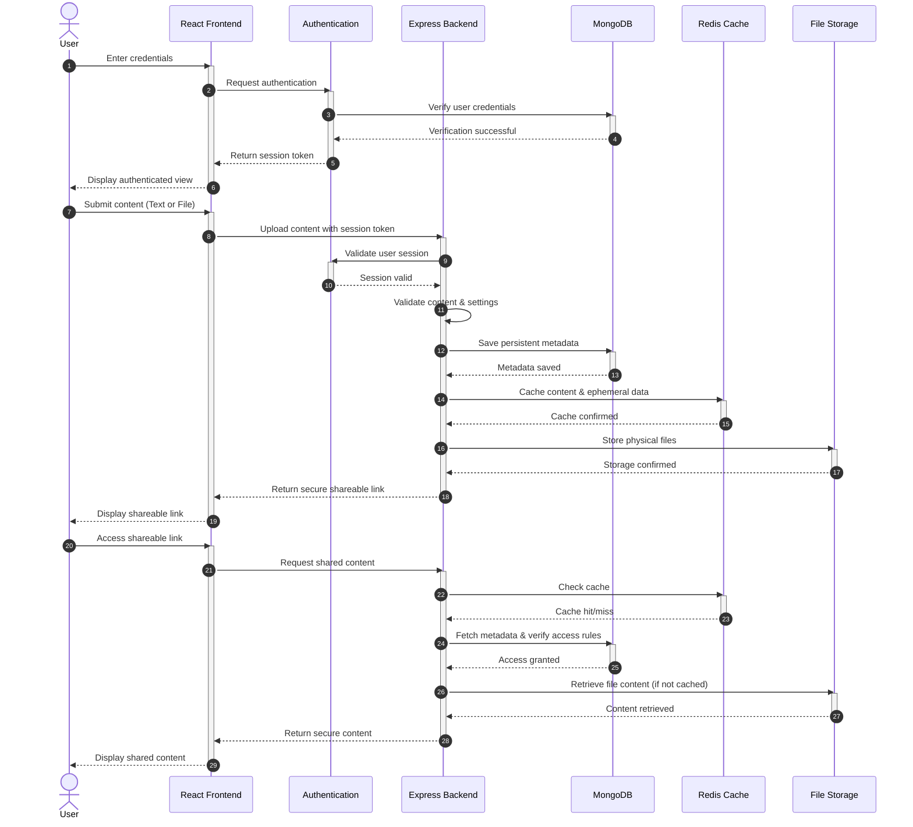

<div align="center">


# ClipHub

### Universal Clipboard & Secure File Sharing Platform

Share text snippets and files instantly across devices with secure links, password protection, expiration controls, and seamless cloud synchronization.

[](https://clipdothub.netlify.app)


</div>

---

# 📖 Table of Contents

- About
- Features
- Tech Stack
- System Architecture
- Sequence Diagram
- Project Structure
- Getting Started
- Environment Variables
- API Overview
- Security Features
- Future Enhancements
- Contributing
- License

---

# ✨ About ClipHub

ClipHub is a modern clipboard and file sharing platform that enables users to securely share text snippets and files across devices using shareable links.

Whether you're moving notes between your laptop and phone, sharing code snippets with teammates, or transferring files without email, ClipHub provides a fast and secure solution.

---

# ✨ Features

## 📝 Text Sharing

- Instant clipboard sharing
- Custom share keys
- Password protection
- Auto expiration
- View limits
- QR code sharing

## 📁 File Sharing

- Secure file uploads
- Multiple file formats
- Download tracking
- Automatic expiry
- Shareable download links

## 👤 Authentication

- JWT Authentication
- User Registration & Login
- Protected Routes
- Profile Management

## ⚡ Performance

- Redis caching
- Fast retrieval
- Optimized API responses
- Efficient storage

## 🔒 Security

- Password hashing
- Input validation
- Rate limiting
- Secure authentication
- Auto cleanup of expired data

---

# 🛠 Tech Stack

| Category | Technologies |
|-----------|--------------|
| Frontend | React, Vite, Tailwind CSS |
| Backend | Node.js, Express.js |
| Database | MongoDB |
| Cache | Redis |
| Authentication | JWT |
| Storage | Local File Storage |
| Deployment | Netlify, Render |

---

# 🏗 System Architecture

> left.

<p align="center">


</p>

---

# 🔄 System Sequence Diagram

> The following sequence diagram outlines the core user journey, from authentication to sharing and downloading content.



---

# ⚙️ How ClipHub Works

1. User signs in (optional for text sharing).
2. User creates a text clip or uploads a file.
3. Backend validates the request.
4. Metadata is stored in MongoDB.
5. Temporary content is cached using Redis when applicable.
6. Files are stored securely.
7. A unique shareable link is generated.
8. Anyone with the link can securely access the shared content.

---

# 📂 Project Structure

```text
ClipHub/
├── client/                 # React Frontend (Vite + Tailwind)
│   ├── public/             # Static assets (Favicon)
│   ├── src/                
│   │   ├── components/     # Reusable UI components
│   │   ├── hooks/          # Custom React hooks
│   │   ├── pages/          # Application pages
│   │   └── utils/          # Frontend utilities
│   ├── package.json        
│   └── vite.config.js      
│
├── server/                 # Express Backend (Global Mode)
│   ├── config/             # DB & Redis connection config
│   ├── controllers/        # Request handlers (Auth, Clip, File)
│   ├── middleware/         # Auth & validation middleware
│   ├── models/             # Mongoose schemas (User, File)
│   ├── routes/             # API route definitions
│   ├── utils/              # Backend utilities (JWT, TTL)
│   ├── index.js            # Main server entry point
│   └── package.json        
│
├── local-server/           # Express Backend (Local LAN Mode)
│
└── README.md               # Project documentation
```

---

# 🚀 Getting Started

## Clone Repository

```bash
git clone https://github.com/Yug1275/ClipHub.git

cd ClipHub
```

---

## Install Dependencies

```bash
npm install
```

---

## Configure Environment Variables

Create a `.env` file inside the server directory.

```env
PORT=

MONGODB_URI=

JWT_SECRET=

REDIS_URL=

CLIENT_URL=
```

---

## Start Development

### Backend

```bash
cd server

npm run dev
```

### Frontend

```bash
cd client

npm run dev
```

Application:

```
Frontend:
http://localhost:5173

Backend:
http://localhost:5000
```

---

# 🌐 Local LAN Mode

ClipHub also supports Local Network mode for sharing content without cloud infrastructure.

Simply start the local server:

```bash
cd local-server

npm run dev
```

Then open

```
http://localhost:5173
```

---

# 📡 API Overview

| Method | Endpoint | Description |
|---------|----------|-------------|
| POST | /api/auth/login | Login |
| POST | /api/auth/register | Register |
| POST | /api/clip | Create Clip |
| GET | /api/clip/:key | Retrieve Clip |
| POST | /api/file | Upload File |
| GET | /api/file/:key | Download File |

---

# 🔒 Security Features

- JWT Authentication
- Password Encryption
- Rate Limiting
- Input Validation
- Protected Routes
- Auto Expiration
- Secure Share Links

---

# ⚡ Storage Architecture

## MongoDB

Stores:

- User Accounts
- File Metadata
- Authentication Data
- Sharing Information

## Redis Cache

Stores:

- Temporary Text Clips
- Frequently Accessed Metadata
- Cached Responses
- Expiry-Based Data

## File Storage

Stores uploaded files securely until expiration.

---

# 🚀 Future Enhancements

- Google Login
- File Preview
- Folder Sharing
- Team Workspaces
- Email Sharing
- Notifications
- End-to-End Encryption

---

# 🤝 Contributing

Contributions are welcome.

1. Fork the repository
2. Create a new branch
3. Commit your changes
4. Push the branch
5. Open a Pull Request

---

# 📄 License

This project is licensed under the MIT License.

---

<div align="center">

### ⭐ If you found this project helpful, consider giving it a star!

**Built with ❤️ by Yug Patel**

</div>
